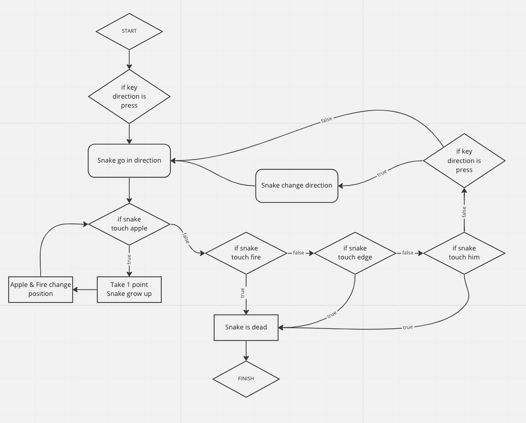

# Snake game:

Here is a python game that uses the principle of the snake game. This game was made as part of a course.

You will find several mechanics there such as the apple which makes the snake grow or the fire which kills our snake and ends the game.

## What is import?
### Random:
### Pygame: 
 https://www.pygame.org/news
#### Why is use: 
to set up a game easily with the python language

## The diagram:

